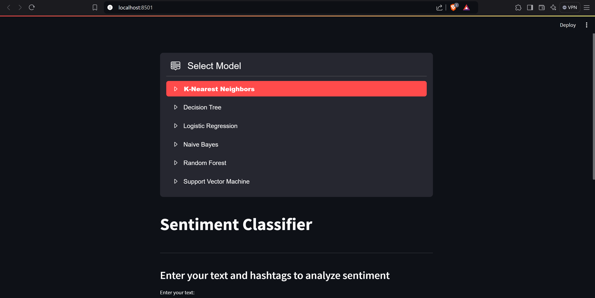
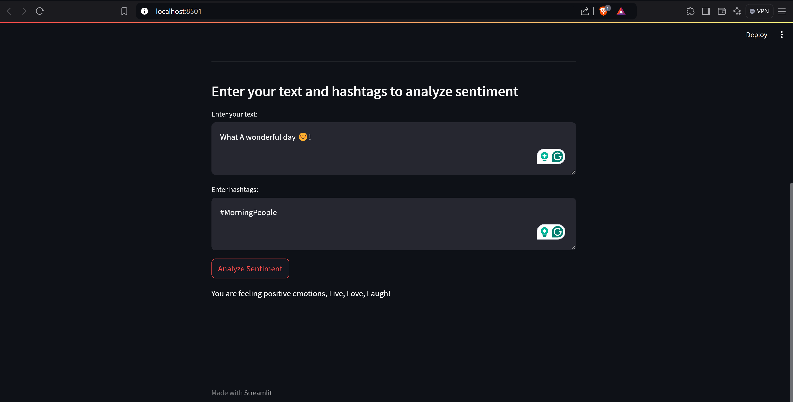
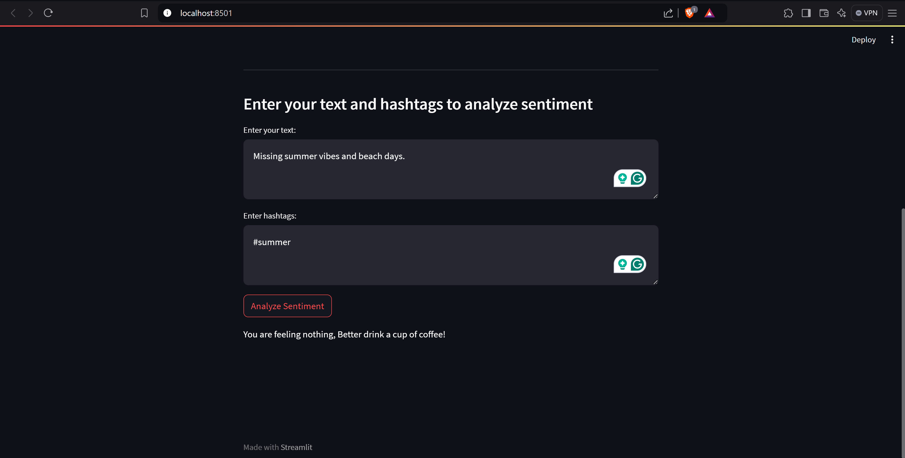
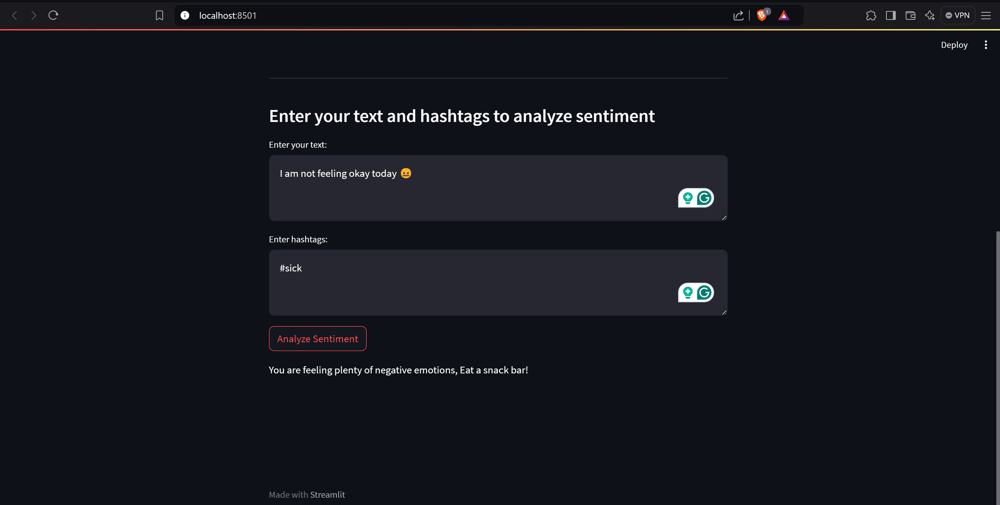

<div align="center">    
 
# Social Media Sentiment Analysis


 


</div>

## 📃Table of Content
- [Description](#-description)
- [Our Progress](#-our-progress)
- [Results](#-results)
- [Screenshots](#-screenshots)
- [How to run](#-how-to-run)
 
<h3 id="-description">🚀Description</h3>   
Social media has become a powerful platform for public opinion and brand perception.  This notebook explores the use of Artificial Intelligence (AI) techniques, specifically sentiment analysis, to understand the sentiment expressed in social media data.  We will delve into the process of data collection, pre-processing, model building, and evaluation to build a system that can automatically classify social media posts as positive, negative, or neutral.

-------------      
 
<h3 id="-our-progress">⏳Our Progress</h3>
We divided the project into five stages:
#### Data Exploration

* **Data import:** We loaded our data into pandas dataframe (736 rows and 14)
* **Column exploration:** Explored every column to know what does it contain and represent in our data and to identify whether it will help our analysis or it is just an identifier (e.g. ID).
* **Redundancy check:** We noticed in this stage that there are 20 redundant columns.
* **String columns space:** We noticed different values for the same string so we deduced it is extra space.

#### Data Cleaning

* **Redundancy removal:** We removed the redundant to prevent any insignificance and striped the spaces from the strings columns.

* **Hashtag column extraction:** Our columns contained multiple hashtags in the same string so we extracted them to different columns.

#### Exploratory Data Analysis

* **Visualization techniques:** We used different visual techniques: pie charts, wordcloud, line plots, scatter plots and bar charts to identify different trends on every social media platform.
* **Trends and patterns:** For every social media platform existed in our data (Facebook, Instagram, and Twitter) we identified it's users interests and usage patterns.

#### Text Preprocessing

* **`clean_text` function:** Utilized the power of `RegEx` and `NLTK` libraries to apply deep cleaning and preprocessing for text data by stemming, removing stop words, punctuation, and numbers.
* **Vectorization:** Vectorized our text using `Bag of Words` and `TF-IDF` methods.

#### Modeling

* **Models:** We used the following models:
  - Logistic Regression.
  - K-Nearest Neighbors.
  - Support Vector Machine.
  - Naive Bayes.
  - Decision Tree.
  - Random Forest. 
* **Experimentation:** We trained the model on two splits: one with bag of words vectorized text and the other using tf-idf.
* **Evaluation metrics:** We evaluated our model using accuracy score, precision, recall, and F1-score and averaging the result with macro.


#### Deployment
* **Models:** After the evaluation we agreed that our best model is `Support Vector Machine` but we gave the user in the deployment the ability to use all the models we trained.

 -------------       
<h3 id="-results">🔬Results</h3>

Using Bow Training Model

| Model Name | Train Accuracy | Test Accuracy |
|---|---|---|
| Logistic Regression | 100% | 85% |
| K-Nearest Neighbors | 87% | 78% |
| Naive Bayes (Multinomial) | 98% | 83% |
| Support Vector Machine (SVM) | 100% | 80% |
| Decision Tree | 100% | 70% |
| Random Forest | 100% | 78% |
  
 Using TF-IDF Training Model

| Model Name | Train Accuracy | Test Accuracy |
|---|---|---|
| Logistic Regression | 94% | 79% |
| K-Nearest Neighbors | 91% | 86% |
| Naive Bayes (Multinomial) | 91% | 85% |
| Support Vector Machine (SVM) | 98% | 85% |
| Decision Tree | 100% | 61% |
| Random Forest | 100% | 76% |

--------------    
<h3 id="-screenshots">📸 Screenshots</h3>
- Title Page
  
- Positive Prediction
   
- Neutral Prediction
   
- Negative Prediction


 -------------     
<h3 id="-how-to-run">🛠️How to run</h3>
First, install dependencies   
```bash
# clone project   
git clone https://github.com/Social-Media-Sentiment-Analysis/NLP-Project
```
```bach
# install dependencies   
cd NLP-Project 
pip install -r requirements.txt
 ```   
 Next, you run this code and the deployment will work locally with you.   
 ```bash
streamlit run deployment.py

```


  

